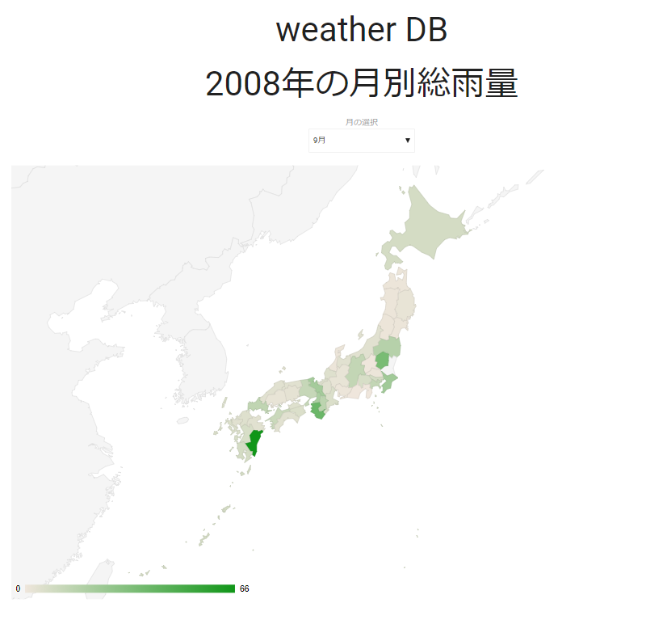

# weatherMap
日本地図に2008年の月別降雨情報をマッピングするシステム

## 言語
- JavaScript
- PHP
- mySQL

## 使用したライブラリ
- [MaterializeCSS](http://materializecss.com/)
- [Google Charts : Visualization: GeoChart](https://developers.google.com/chart/interactive/docs/gallery/geochart)

## デモ
[weatherMap](http://matayoshi.nkmr.io/work/webcontents/weather/)
